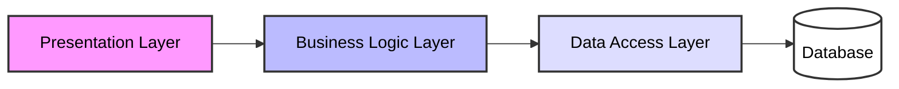
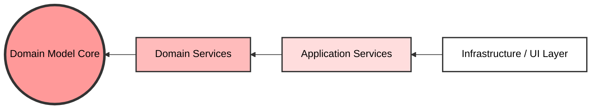

# LexisNexis Interview Study Guide: Software Architecture Matrix

## Part 1: Layered Architecture vs. Onion Architecture

### Architectural Comparison

| Evaluation Metric | Traditional Layered Architecture | Onion Architecture |
| :--- | :--- | :--- |
| **Core Architecture Principle** | Database-centric / N-Tier pipeline execution | Domain-driven / Dependency Inversion execution |
| **Dependency Vector** | Top-down (Presentation → Business → Data Access) | Inward (Outer rings depend exclusively on inner rings) |
| **Database Coupling Status** | Foundation layer; business rules explicitly depend on it | Infrastructure detail; exists on the outermost ring |
| **Code Abstraction Level** | Low; high coupling to object-relational mappers (ORMs) | High; domain layer contains zero framework code |
| **Unit Testing Strategy** | Complex; requires heavy database mocking/stubbing | Simple; fast unit testing of pure domain logic |
| **Component Swappability** | Rigid; UI or DB modifications trigger cascading breaks | Fluid; adapters change without impacting the core domain |

---

### Core Structural Layouts

#### Traditional Layered Flow

#### Onion Architecture (Concentric Dependencies)

---

| Dimension | Macro Architecture (Monolith vs. Modular Monolith) | Micro/Logical Architecture (Layered vs. Onion) |
| :--- | :--- | :--- |
| **Focus** | How the system is split into business features and deployed. | How the technical code inside is structured logically into components. |
| **Boundaries** | Vertical boundaries (e.g., separating Orders from Billing). | Horizontal boundaries (e.g., separating UI from Database). |
| **Key Question** | "Do all features live in one project, or are they isolated modules?" | "Does my business logic depend on my database, or vice versa?" |

---

### 💡 High-Yield Interview Notes (Layered vs. Onion)

* **Dependency Inversion Principle (DIP):** Onion architecture is the enterprise implementation of DIP. The core domain layer declares the abstractions (interfaces), while the outer infrastructure layer implements those interfaces.
* **LexisNexis Application Context:** LexisNexis applications manage extensive text indexes, public records, and legal graphs. Onion architecture allows you to change the storage implementation (e.g., migrating from an on-premise relational database to an AWS cloud-managed NoSQL store) by updating only the infrastructure layer, leaving complex legal evaluation logic untouched.
* **Database-First vs. Domain-First:** Traditional layered systems require designing database tables first. Onion architecture forces a Domain-First approach where business entities and rules are modelled first, entirely decoupled from data storage considerations.

---

## Part 2: Monolithic vs. Modular Monolithic vs. Microservices

### Ultimate Architectural Comparison Matrix

| Evaluation Metric | Monolithic | Modular Monolithic | Microservices |
| :--- | :--- | :--- | :--- |
| **Deployment Unit** | Single application artifact | Single application artifact | Multiple independent network artifacts |
| **Runtime Isolation** | None; all logic runs in one process | None; modules share one process | Complete; services run in distinct processes |
| **Code Base Structure** | Unified single codebase repository | Managed modules inside one repository | Isolated individual service repositories |
| **Data Architecture** | Single shared database | Shared database with isolated schemas | Strict database-per-service isolation |
| **Inter-Component Calls** | In-memory stack execution | In-memory via public interfaces | Over-the-network (REST, gRPC, MQ) |
| **Transaction Strategy** | Local ACID transactions (Easy) | Local ACID transactions (Easy) | Distributed transactions / Saga pattern (Hard) |
| **Operational Overhead** | Low; simple CI/CD pipelines | Low; standard deployment configurations | Very high; requires service mesh and k8s |
| **Blast Radius (Failure)** | System-wide (Single fault crashes app) | System-wide (Single fault crashes app) | Isolated (Graceful degradation handles faults) |
| **Horizontal Scaling** | Uniform scaling of entire codebase | Uniform scaling of entire codebase | Granular scaling of specific bottlenecks |

Vertical + Uniform: Upgrading a cloud server to the next official tier (e.g., doubling both CPU and RAM together).
Vertical + Granular: Keeping the same server but adding only 50GB of SSD storage because your database is full.
Horizontal + Uniform: Adding 5 identical, pre-configured web-server instances to your cluster to handle a traffic spike.
Horizontal + Granular: In a microservices architecture, adding more instances of only the "Payment Service" while leaving the "Inventory Service" instances alone.

---

### Deep-Dive Architectural Profiles

#### 1. Monolithic Architecture
A unified software system where all components—user authentication, payment processing, report generation, and data access—are compiled and packaged as a single deployment artifact.

* **Primary Benefits:**
  * Simple to develop, step-debug, profile, and test early in the lifecycle.
  * Zero network latency or serialization overhead between internal modules.
  * Straightforward deployments without complex orchestrators.
* **Core Disadvantages:**
  * Codebase naturally degrades into a "Big Ball of Mud" as features grow.
  * Long build times and slow deployment pipelines limit team velocity.
  * Inefficient scaling forces you to duplicate the entire app footprint to scale one bottleneck.
* **When to Deploy:**
  * Small development groups (1 to 2 agile product teams).
  * Proof of concepts (PoCs) or early validation MVPs.
  * Systems with straightforward business domains and low raw throughput.

#### 2. Modular Monolithic Architecture
A single deployment unit containing explicitly isolated logical modules. Modules enforce compile-time or package boundaries and interface strictly through clean public APIs.

* **Primary Benefits:**
  * Provides structural separation of concerns without introducing network latency.
  * Fast local developer execution loops and simple integration testing.
  * Establishes a highly structured migration path to microservices if needed later.
* **Core Disadvantages:**
  * Demands continuous code discipline and architectural linter checks to stop boundary leaks.
  * Runtime crashes still impact the whole system due to the single process model.
  * Independent module scaling remains impossible under heavy traffic loads.
* **When to Deploy:**
  * Mid-sized engineering structures (3 to 5 separate product teams).
  * Highly complex business domains that need to avoid distributed systems overhead.
  * Applications requiring clear code ownership without microservice deployment friction.

#### 3. Microservices Architecture
An architectural pattern that breaks an application into a network of autonomous, loosely coupled services. Each service owns its runtime process, data schemas, and deployment lifecycle.

* **Primary Benefits:**
  * High deployment velocity; teams deploy updates without syncing with other teams.
  * Precision scalability lets you resource-allocate specific bottlenecks independently.
  * Polyglot freedom allows picking different languages, frameworks, or databases per service.
* **Core Disadvantages:**
  * Severe operational tax spanning distributed tracing, log aggregation, and mesh routing.
  * Complex data management challenges including eventual consistency, data joins, and syncs.
  * Hard-to-trace partial failure modes caused by network partitions and timeouts.
* **When to Deploy:**
  * Large-scale software engineering organisations (dozens of distributed teams).
  * High-throughput applications with vastly different infrastructure requirements per feature.
  * Domains requiring high-velocity deployment cycles across independent teams.

---

### 💡 High-Yield Interview Notes (Monolith vs. Microservices)

* **Conway's Law:** "Organizations design systems which mirror their communication structures." Highlight that microservices are as much an **organisational solution** for scaling engineering teams as they are a technical solution for performance.
* **The Fallacy of Distributed Computing:** Avoid assuming networks are fast, reliable, or secure. Moving from a monolith to microservices trades local CPU speed for network hops, which adds latency and introduces partial network failure states.
* **LexisNexis Application Context:** For core search and indexing tools handling billions of document requests, microservices fit well (e.g., separating document parsing, search queries, and payment processing). However, for analytical internal workflows, using a modular monolith avoids complex distributed transaction overhead.

# Software Architecture Reference Guide: Monoliths, Modules, and Microservices

This comprehensive guide outlines the differences between macro-level deployment architectures and micro-level logical code organization, along with strategies for modern C#/.NET application design.

---

### The Macro View: Monolith vs. Modular Monolith
* **Traditional Monolith:** The entire system is built as a single, indivisible unit. In .NET, this often looks like one giant API project where controllers call repositories across different domains directly. Code easily becomes tightly coupled over time ("Big Ball of Mud").
* **Modular Monolith:** The application is still deployed as a single unit (one running process, one database), but the code is strictly separated into independent **modules** by business capability (e.g., `Catalog`, `Orders`, `Shipping`). Each module acts like its own isolated "mini-app" with its own database context or schema.

### The Micro View: Layered vs. Onion
* **Layered (N-Tier) Architecture:** Code flows downward vertically: **Presentation Layer → Business Logic Layer → Data Access Layer**. In C#, this means your core business logic project directly references and depends on your Entity Framework/Data Access project.
* **Onion (Clean) Architecture:** Code flows inward toward the Domain. The core business rules and domain entities sit at the very center and have **zero dependencies** on external frameworks or databases. The database layer (Infrastructure) points inward to implement interfaces defined by the core domain using the Dependency Inversion Principle.

---

## 2. Modular Monolith vs. Microservices

The main difference is **how they are deployed and how they communicate**. A Modular Monolith runs as a **single application process** sharing one physical database, while Microservices run as **multiple independent processes** each with their own strictly isolated database.

| Feature | Modular Monolith | Microservices |
| :--- | :--- | :--- |
| **Process Count** | One single process | Many separate processes |
| **Network Latency** | Zero (In-memory calls) | High (Network calls over HTTP/gRPC) |
| **Data Consistency** | Easy (ACID Transactions) | Hard (Eventual Consistency / Saga Pattern) |
| **DevOps Complexity** | Low (Single CI/CD pipeline) | High (Kubernetes, Service Meshes) |
| **Scaling** | Scale the whole app together | Scale individual services independently |
| **Team Autonomy** | Medium (Shared repository) | High (Independent codebases and pipelines) |

### The Database Rules
* **Microservices require database isolation:** By definition, a true microservice must strictly own its own database or data store. Sharing tables across services creates a **"Distributed Monolith"** (an anti-pattern combining the deployment complexity of microservices with the tight coupling of a monolith).
* **Isolation Levels:** "Separate database" can mean **Logical Isolation** (different database schemas/logical databases on the same physical cluster) or **Physical Isolation** (entirely separate database server instances).
* **Stateless Services exception:** Services like a real-time Notification Pipe using WebSockets may not need a database at all if they act as a pure data router. Instead, they often use an in-memory cache like **Redis** to track active connections across instances.

---

## 3. Future-Proofing Strategy: Evolutionary Architecture

When launching a new product, the biggest risk is not system scale—it is **market fit and changing requirements**. Microservices slow down early-stage development. The safest, most future-proof strategy is to start with a **Modular Monolith using Onion Architecture inside each module**.

[ Your Entire App (Single Deployable Process) ]├── Module A (e.g., Identity) ──> Internal Onion Architecture├── Module B (e.g., Billing)  ──> Internal Onion Architecture└── Module C (e.g., Ordering) ──> Internal Onion Architecture

### 🎯 Domain-Driven Design (DDD) Integration

*   **The Blueprint Rule:** Use DDD **Bounded Contexts** to draw the vertical boundaries for your **Modular Monolith modules** or **Microservices** (e.g., separating `Billing` from `CaseManagement`), preventing the code from degrading into a "Big Ball of Mud".
*   **The Inward Core:** Inside each module, place your DDD **Aggregate Roots, Entities, and Value Objects** at the absolute center of the **Onion Architecture**. This ensures core business rules have zero compile-time dependencies on database ORMs or cloud providers.

### Monolith to Microservices Transition
*   **Strategy:** Implement the **Strangler Fig Pattern** to break down legacy apps incrementally instead of a risky "Big Bang" rewrite.
*   **Execution:** 
    1. Define domain boundaries using Domain-Driven Design (DDD).
    2. Route all traffic through an **API Gateway** pointing initially to the monolith.
    3. Carve out a single domain into an independent .NET container with its own database schema.
    4. Repoint the gateway route to the new microservice. Repeat until the monolith is deprecated.

| What the Panel Asks | The Knockout Keywords You Will Use |
| :--- | :--- |
| **"How do you prevent a codebase from becoming a Big Ball of Mud?"** | Using **DDD Bounded Contexts** to establish strict vertical feature walls. |
| **"What is the actual downside of moving directly to Microservices?"** | **The Fallacy of Distributed Computing**; trading local memory speed for network latency and partial failure modes. |
| **"How do you ensure your domain logic isn't tied to your database choice?"** | **The Dependency Inversion Principle (DIP)**; the Core Domain defines abstractions, and Infrastructure implements them. |
| **"What happens if Services need to share a database?"** | That creates a **Distributed Monolith** anti-pattern, combining microservice network tax with monolithic coupling. |
| **"How do we transition a live legacy monolith safely?"** | Deploying an API Gateway layer to execute the **Strangler Fig Pattern** incrementally. |
